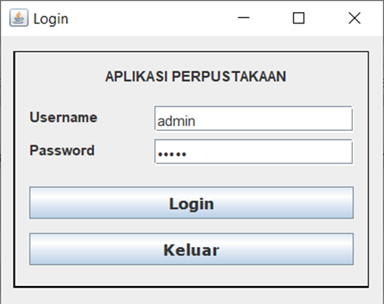
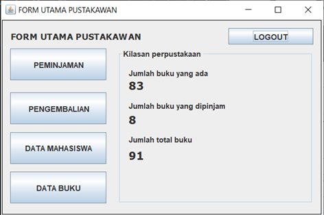
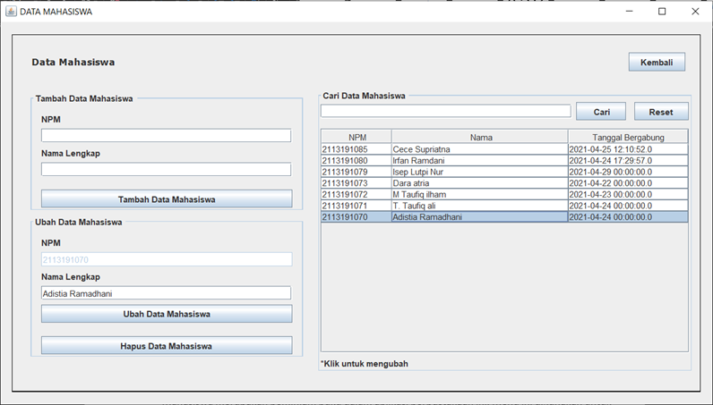
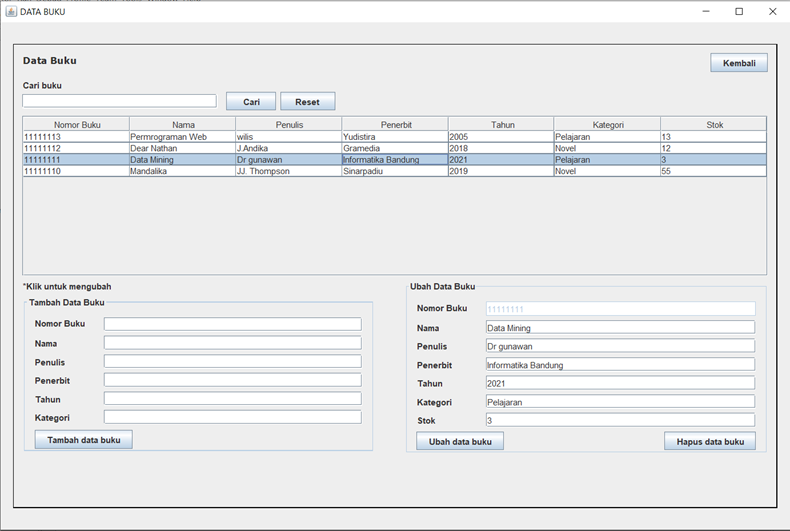
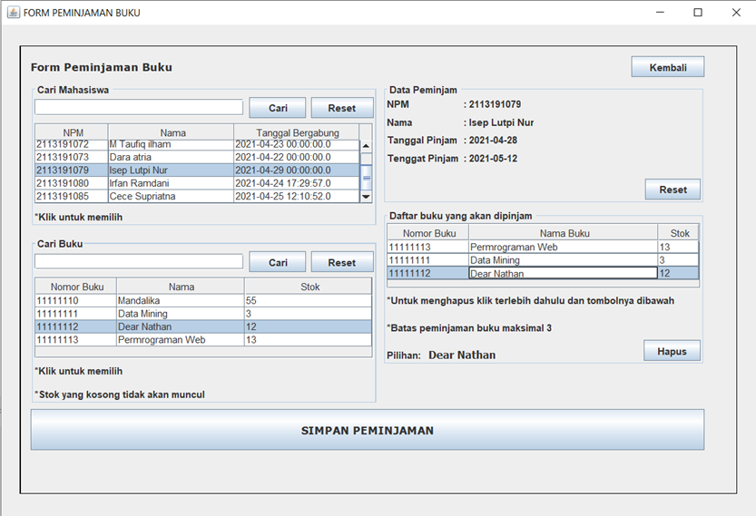
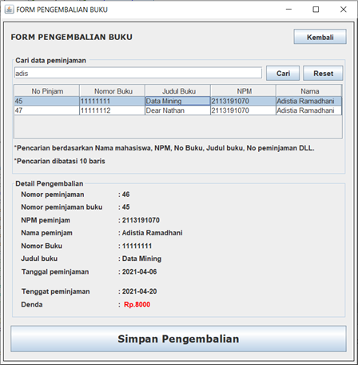

Nama: Isep Lutpi Nur

NPM: 2113191079

Mata Kuliah: Pemrograman berorientasi objek

Tugas: Projek Akhir Aplikasi perpustakaan

Kelas: Teknik Informatika A2 2019

### Cara pemasangan

1. Import database perpustakaan.sql.
2. Sesuaikan configurasi database di Koneksi, sesuaikan dengan konfigurasi database masing masing.

### Cara penggunaan

1. Setelah pemasangan  aplikasi bisa di buka di folder dist disana ada Perpustakaan.jar buka dan pastikan java runtime sudah terpasang dalam komputer anda.

2. Terdapat beberapa fitur dalam aplikais ini diantaranya:

   **1.**      **Login Sistem**

  

   Saat pertama kali masuk kedalam aplikasi akan diahadapkan dengan login.

   Username dan password diambil dari database table admin atau admin bisa disebut juga sebagai pustakawan. Untuk saat ini bisa menggunakan username: admin dan password: admin.

   Setelah berhasil login maka akan diarahkan ke menu utama.

  

   Dalam menu utama terdapat beberapa menu pilihan.

   \-    Data Mahasiswa

  

   Mahasiswa merupakan peminjam buku dalam aplikasi perpustakaan ini. Menu ini digunakan untuk memanipulasi data mahasiswa seperti mencari, ubah, hapus dan tambah.

   \-    Data Buku

  

   Data buku merupakan hal yang penting dalam aplikasi perpustakaan ini. Menu ini digunakan untuk memanipulasi data buku seperti mencari, ubah, hapus dan tambah.

   **2.**      **Peminjaman**

  

   Untuk melakukan peminjaman pertama dari menu utama pilih peminjaman:

   \-    Pertama cari data mahasiswa yang akan meminjam buku dalam panel cari mahasiswa lalu klik row atau baris mahasiswa yang dicari.

   \-    Kemudian cari buku yang akan dipinjam lalu klik row atau baris hasil pencarian buku.

   \-    Untuk menyimpan peminjaman klik tombol simpan peminjaman.

   \-    Peminjaman buku dibatasi maksimal 3

   **3.**      **Pengembailan**

  

   Untuk mengembalikan buku yang dipinjam di menu utama pliih tombol Pengembalian.

   \-    Cari data pengembalian kata kunci nya bisa npm, nama mahasiswa, nomor peminjaman, dan nomor buku.

   \-    Klik hasil row atau baris yang ada di table kemudian Tekan tombol simpan pengambilan.

   **4.**      **Denda**

   Denda dalam aplikasi ini dihitung dari tenggat tanggal peminjaman. Peminjaman diberi waktu 2 minggu atau 14 hari jika lebih dari itu maka akan di denda setap 1 hari 1000 rupiah.

  

   Contohnya sekarang tanggal 2021-04-28, disini terlambat 8 hari dari tanggal tenggat maka dendanya 8000 rupiah. Dibawah merupakan fungsi untuk membandingan tanggal untuk denda.

  

